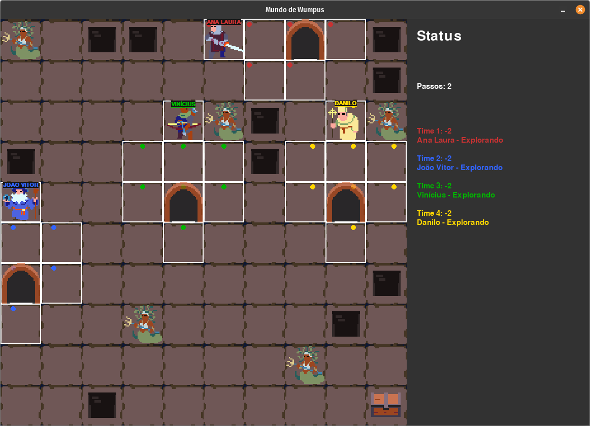

# 🧠 Mundo de Wumpus Multiagente Cooperativo


Uma implementação do clássico problema do Mundo de Wumpus utilizando múltiplos agentes cooperativos, desenvolvida em Python com interface gráfica utilizando Pygame.

Os agentes exploram um ambiente parcialmente observável, compartilham conhecimento e trabalham em equipe para localizar o ouro, evitar perigos e maximizar a taxa de sucesso da exploração.

---

## 📸 Visão Geral

O Mundo de Wumpus é um ambiente clássico da Inteligência Artificial utilizado para estudar:

* Agentes Inteligentes
* Representação de Conhecimento
* Inferência Lógica
* Ambientes Parcialmente Observáveis
* Cooperação entre Agentes
* Tomada de Decisão

Neste projeto, vários agentes atuam simultaneamente em equipes independentes, explorando o ambiente e construindo conhecimento sobre o mundo à medida que avançam.



---

## 🎯 Funcionalidades

* ✅ Simulação completa do Mundo de Wumpus
* ✅ Interface gráfica em tempo real
* ✅ Múltiplos times
* ✅ Múltiplos agentes por time
* ✅ Compartilhamento de conhecimento
* ✅ Sistema de inferência baseado em percepções
* ✅ Configuração via arquivo `.ini`
* ✅ Controle de velocidade da simulação
* ✅ Visualização do estado do ambiente

---

## 🗺️ Ambiente

O mundo é representado por uma grade NxN contendo:

| Elemento  | Descrição                     |
| --------- | ----------------------------- |
| 🤖 Agente | Explorador controlado pela IA |
| 🐲 Wumpus | Monstro letal                 |
| 🕳️ Poço  | Armadilha fatal               |
| 💰 Ouro   | Objetivo principal            |
| 👃 Fedor  | Indica Wumpus adjacente       |
| 💨 Brisa  | Indica poço adjacente         |

Os agentes precisam:

1. Explorar o mapa.
2. Inferir posições perigosas.
3. Compartilhar descobertas.
4. Encontrar o ouro.
5. Sobreviver durante a exploração.

---

## ⚙️ Configuração

O comportamento da simulação pode ser ajustado através do arquivo `config.ini`.

### Exemplo

```ini
[agentes]
n_times = 5
n_agentes_p_time = 2

[mundo]
grid_size = 8

[interface]
panel_width = 360
tamanho_height_width = 800

[engine]
timer_movimento = 300
fps_limit = 60
```

### Parâmetros

| Configuração           | Descrição                        |
| ---------------------- | -------------------------------- |
| `n_times`              | Número de equipes                |
| `n_agentes_p_time`     | Quantidade de agentes por equipe |
| `grid_size`            | Tamanho do mapa                  |
| `panel_width`          | Largura do painel lateral        |
| `tamanho_height_width` | Resolução da janela              |
| `timer_movimento`      | Intervalo entre movimentos (ms)  |
| `fps_limit`            | Limite de FPS                    |

---

## 🏗️ Estrutura do Projeto

```text
.
├── agente.py                 # Comportamento dos agentes
├── ambiente.py               # Representação do mundo
├── busca.py                  # Algoritmos de busca
├── conhecimento.py           # Base de conhecimento
├── interface.py              # Interface gráfica
├── sprites.py                # Gerenciamento de sprites
├── inicializacao_cenario.py  # Geração do ambiente
├── config_parser.py          # Leitura das configurações
├── main.py                   
│
├── assets/
│   ├── animals.png
│   ├── items.png
│   ├── monsters.png
│   ├── rogues.png
│   └── tiles.png
│
├── config.ini
└── requirements.txt
```

---

## 🚀 Instalação

Clone o repositório:

```bash
git clone https://github.com/iaguian0/Mundo-de-Wumpus.git
```

Entre na pasta:

```bash
cd Mundo-de-Wumpus
```

Crie um ambiente virtual:

### Linux

```bash
python3 -m venv venv

source venv/bin/activate
```

### Windows

```powershell
python -m venv venv

venv\Scripts\activate
```

Instale as dependências:

```bash
pip install -r requirements.txt
```

---

## ▶️ Executando

```bash
python main.py
```

Após a inicialização, a interface gráfica exibirá:

* O ambiente
* Os agentes em movimento
* Informações da simulação
* Estado do conhecimento construído durante a exploração

---

## 🧠 Sistema de Conhecimento

Os agentes utilizam percepções do ambiente para inferir informações sobre células desconhecidas.

Exemplos:

* Brisa → possível poço adjacente
* Fedor → possível Wumpus adjacente
* Ausência de percepções → células vizinhas seguras

O conhecimento acumulado pode ser compartilhado entre agentes da mesma equipe, permitindo uma exploração mais eficiente.

---

## 🛠 Tecnologias Utilizadas

* Python 3
* Pygame

